# Digital Logic Latches and Flip-Flops

Gate-level design and simulation of common latches and flip-flops using Intel Quartus.

This project explores the operation of sequential logic circuits by constructing SR, D, JK, and T storage elements from basic logic gates. Each design was implemented as a Quartus Block Diagram/Schematic File (`.bdf`) and evaluated using simulated input and output waveforms.

## Implemented Circuits

### Latches
- SR Latch
- D Latch
- JK Latch

### Flip-Flops
- SR Flip-Flop
- D Flip-Flop
- JK Flip-Flop
- T Flip-Flop

## Design Overview

The project begins with the SR latch as the fundamental bistable storage element and develops additional latch and flip-flop architectures from it.

The designs demonstrate several important sequential-logic concepts:

- Cross-coupled logic gates for state storage
- Set, reset, hold, and toggle operations
- Complementary `Q` and `Qbar` outputs
- Elimination of invalid SR input states
- Gated latch operation
- Output feedback in JK designs
- Master-slave flip-flop construction
- Clock-controlled state transitions
- T flip-flop toggle behavior

## SR Latch

The SR latch is implemented using cross-coupled logic gates and provides set and reset inputs. With neither input asserted, the circuit retains its previous state.

The SR latch also demonstrates the invalid input condition that occurs when both set and reset are asserted simultaneously.

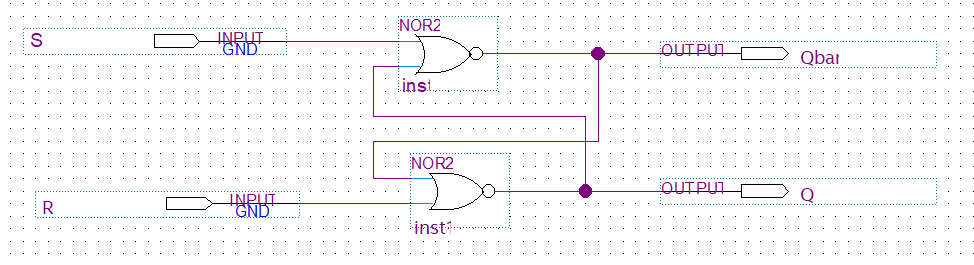

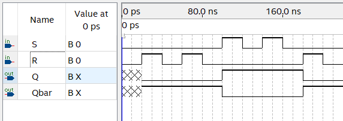

## D Latch

The D latch derives its reset input from the complement of the data input. This reduces the latch to a single data input and prevents the invalid input combination associated with the basic SR latch.

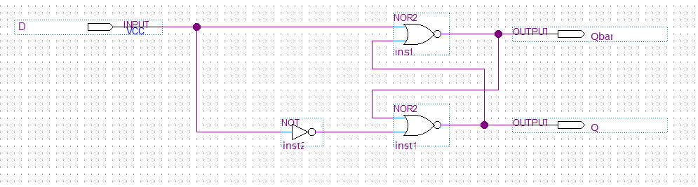

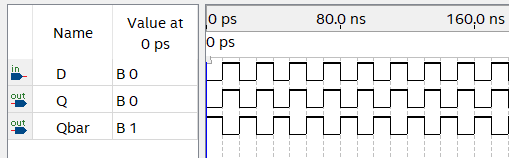

## JK Latch

The JK latch uses output feedback to control the set and reset paths. This eliminates the invalid state of the SR latch and allows both inputs to be asserted simultaneously.

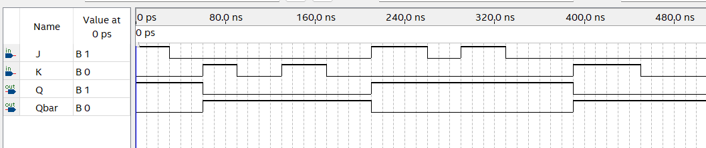

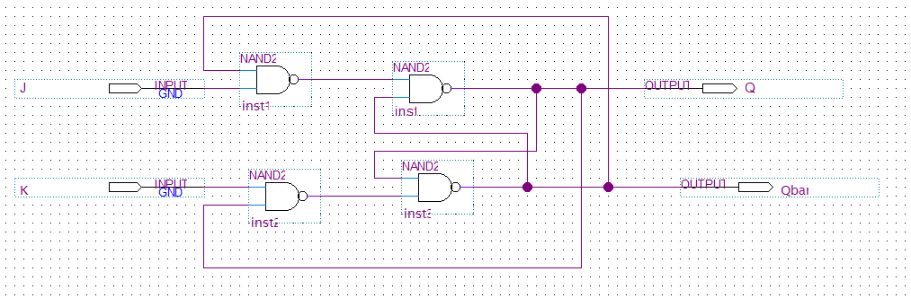

## Flip-Flops

The SR, D, and JK flip-flops use master-slave configurations in which two gated latch stages operate on opposite phases of the clock.

This allows the output state to be synchronized with the clock rather than continuously responding to changes at the inputs.

### SR Flip-Flop

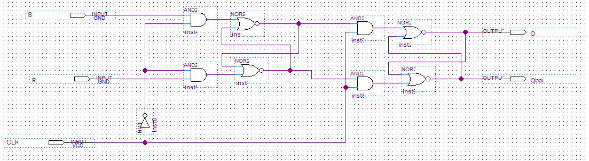

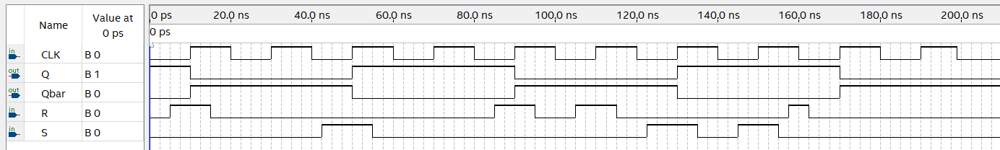

### D Flip-Flop

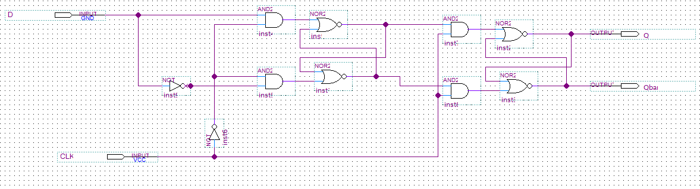

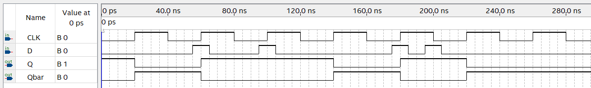

### JK Flip-Flop

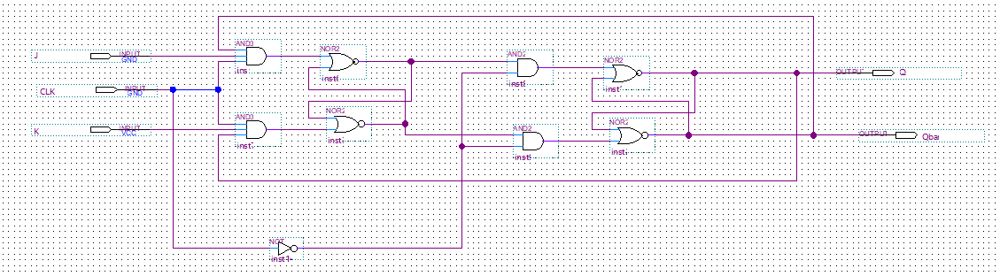

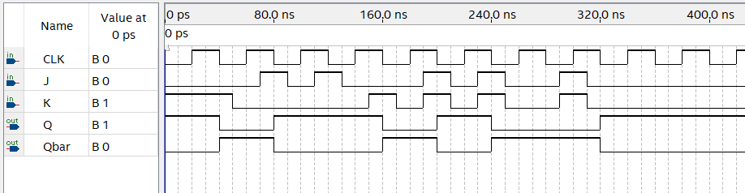

## T Flip-Flop

The T (toggle) flip-flop changes its output state at the active clock transition when `T = 1`. When `T = 0`, the previous state is retained.

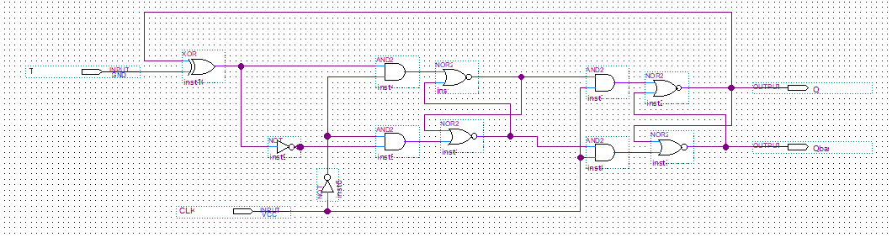

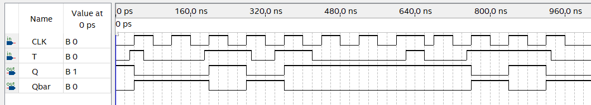

## Repository Structure

```text
Digital-Logic-Latches-and-Flip-Flops/
├── BlockDiagramFiles/
│   ├── D_Latch.bdf
│   ├── D_FlipFlop.bdf
│   ├── JK_Latch.bdf
│   ├── JK_FlipFlop.bdf
│   ├── SR_Latch.bdf
│   ├── SR_FlipFlop.bdf
│   └── T_FlipFlop.bdf
│
├── Screenshots/
│   ├── *_diagram.png
│   └── *_waveforms.png
│
├── Documentation/
│   ├── Latches and Flip Flops.docx
│   └── TruthTables.xlsx
│
└── README.md
